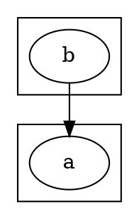
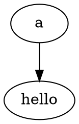

# Declared-vs-referenced cluster membership — design proposal

**Status:** proposed (task #148)
**Scope:** `gvpy/grammar/gv_visitor.py` + optional flag on `Graph.add_node`
**User-facing DOT syntax:** no change

## Problem

When the DOT parser encounters an edge inside a subgraph body, it
adds both endpoints to that subgraph's node list even if the nodes
are declared elsewhere:



Current Python parser produces:
- `cluster_A.nodes = {a}`
- `cluster_B.nodes = {a, b}`  ← **a spuriously included**

C's semantics (per `lib/dotgen/cluster.c: mark_lowclusters`):
- `cluster_A.nodes = {a}`
- `cluster_B.nodes = {b}`

Downstream effect in `dedup_cluster_nodes` — session 17 hit this
on 1332.dot, where `c4051` was declared in `clusterc4051` but
edge-referenced in `cluster_4250`, and the depth-tie-break
mis-assigned it to `cluster_4250`.  A size-based tie-break
(session 17 attempt) is theoretically correct but produced corpus
regressions because it over-constrained singleton wrappers.

The **root cause** is at parse time: Python's visitor doesn't
distinguish "declared here" from "referenced in an edge here".

## Decision: no DOT syntax change

The DOT language already distinguishes these two cases at the
grammar level:

| Grammar rule | Meaning | Current `add_node` call |
|---|---|---|
| `node_stmt` | Declaration (creates/updates node) | `add_node(name, create=True)` |
| `edge_stmt` endpoint | Reference (establishes an edge) | `add_node(name, create=True)` |

Both rules currently call the same method and the subgraph
attribution is lost.  **The fix is a parser-level flag, not a new
language feature.**

Reasons to avoid introducing new syntax:

1. **Compatibility.** Any DOT syntax change would diverge from the
   canonical Graphviz grammar and break third-party DOT corpora.
2. **Redundant.** The grammar already carries the information we
   need — `node_stmt` vs `edge_stmt` is a structural distinction.
3. **C parity.** C's parser handles this without any syntax
   extension by tracking which subgraph "owns" each node at
   `agnode` time.
4. **Minimal surprise.** Users writing `subgraph cluster_B { b -> a; }`
   reasonably expect `a` to keep its declared home, not be
   re-attributed to `cluster_B`.

## Proposed implementation

### 1. Extend `Graph.add_node` with a `declared` flag

```python
# gvpy/core/_graph_nodes.py
def add_node(
    self,
    n_name: str,
    create: bool = True,
    declared: bool = True,   # NEW
) -> Optional["Node"]:
    """
    ...
    :param declared: If True (default), register the node as a
        *member* of this subgraph.  If False, ensure the node
        exists (create in root if needed) but do NOT add it to
        this subgraph's ``self.nodes`` dict.  Used by the visitor
        for edge-endpoint lookups that shouldn't imply cluster
        membership.  Matches C's agnode semantics where
        referenced-only nodes keep their declared cluster.
    """
```

Semantic contract:

- `declared=True` (default): current behavior — create node if
  needed, add to every ancestor's `self.nodes`.  Callers: direct
  `node_stmt` processing, programmatic graph construction.
- `declared=False`: create node in root graph if missing, ensure
  it's reachable via `self.get_root().nodes[name]`, but do NOT
  add to `self.nodes` on subgraphs the caller is in.  Callers:
  edge-endpoint resolution inside a subgraph body.

### 2. Update the visitor — two call sites

```python
# gvpy/grammar/gv_visitor.py

def visitNodeStmt(self, ctx):
    # UNCHANGED — node_stmt means declaration, register as member.
    name = self._get_id_text(ctx.nodeId().id_())
    node = self._current.add_node(name, create=True)
    ...

def _resolve_node_id(self, ctx):
    """Resolve a node_id context in an edge_stmt.  Ensure the
    node exists (creating in root if needed) but DON'T add it to
    the current subgraph's member list — that's a reference, not
    a declaration.  Matches C cgraph semantics."""
    name = self._get_id_text(ctx.id_())
    self._current.add_node(name, create=True, declared=False)  # CHANGED
    port = self._get_port_text(ctx.port()) if ctx.port() else ""
    return name, port
```

### 3. Simplification on the consumer side

With declared-vs-referenced tracked correctly at parse time,
`cluster.py: dedup_cluster_nodes` becomes largely redundant.  The
"edge reference inflation" it exists to fix won't happen anymore.
We can either:

(a) Leave it in place as a belt-and-suspenders pass — no harm,
    the home-assignment logic won't fire on any conflicts once
    the parser is fixed.

(b) Simplify it to just "if a node appears in multiple clusters
    via `declared=True`, use tree depth" — the size/tie-break
    hack becomes unnecessary.

I recommend **(a)** for now and revisit after the fix is measured
in the corpus.

## Edge cases

### Subgraph-as-endpoint

DOT allows edges between subgraphs:

```dot
subgraph cluster_A { a; b; } -> subgraph cluster_B { c; d; }
```

This creates all `a→c, a→d, b→c, b→d` edges.  The current
`visitEdgeStmt` handles this via `_expand_endpoint`.  Our flag
doesn't affect this path — each node inside each subgraph is
still declared via its own `node_stmt` inside the subgraph body.

### Anonymous subgraphs used as rank/rank=same groupings

```dot
{ rank=same; a; b; c; }
```

These are anonymous subgraphs.  Their nodes are declared (not
referenced via edges), so our flag default correctly adds them
to the anonymous subgraph's member list.  Unchanged.

### Nested subgraph edges spanning clusters

```dot
subgraph cluster_A {
    a;
    subgraph cluster_B {
        b;
        a -> b;     // a referenced, b declared
    }
}
```

Currently: `cluster_B.nodes = {a, b}`.  After fix:
`cluster_B.nodes = {b}`, matching C — `a` stays in `cluster_A`.

### Forward references



First call (edge endpoint) with `declared=False`: creates `b` in
the root graph, doesn't mark any cluster as home.  Second call
(node_stmt) with `declared=True`: finds existing node, marks
root as home (it's at root scope here).  Result: `b ∈ root`,
correct.

## Expected corpus impact

Graphs exercising the bug (all have nodes declared in one
cluster but edge-referenced in another):

- **1332.dot, aa1332.dot, 1332_ref.dot** — c4051, c4149 correctly
  attributed to `clusterc4051`, `clusterc4149` singletons.  Less
  scope pollution in cluster_4250's mincross.
- **1472.dot** — similar pattern around its top-level clusters.
- **1213-1.dot, 1213-2.dot** — small cluster graphs with
  cross-cluster edge references.
- **d5_regression.dot** — our test fixture has clean declarations,
  probably unaffected.
- **2796.dot** — has C-side failures, may not measure.

Pending measurement.  Session 17's size-based tie-break revert
suggests this area is sensitive — we should expect some shuffling
and measure carefully.  The fix is SMALLER in scope than session 17
(only changes how nodes are registered at parse time; doesn't
force singletons to own their one node — just stops spurious
pollution).

## Testing plan

1. Unit test: `test_edge_references_dont_add_to_subgraph` —
   construct a graph with the pattern above, assert membership.
2. Regression test: existing 1137 tests must continue to pass.
3. Corpus audit: expect 1332-family graphs to improve or stay
   stable.  If 1879.dot-class HTML-label regressions appear,
   those are unrelated (session 16 discussed).

## Not in scope

- New DOT syntax keywords.
- Changes to the ANTLR4 grammar (`.g4`) file.
- Changes to the generated parser (`GVParser.py`, `GVLexer.py`).
- DOT output format — the writer side can continue to emit edges
  inside subgraph bodies as before.  We're just changing how we
  INTERPRET that syntax on the input side.
