# GraphvizPy — Layout Engine Comparison Report

Side-by-side renders of every GraphvizPy layout engine against
the reference C Graphviz implementation, using each engine's
demo file from [`test_data/`](test_data/).

The left column shows output from the reference C `dot.exe`
(the upstream Graphviz binary on this machine).  The right
column shows output from GraphvizPy's `gvcli.py` running the
fully ported, C-aligned Python implementation of the same
engine.

All Python engines now bit-align with C (see [DONE.md](DONE.md)
sections §4.D, §4.N, §4.T, §4.F, §4.S, §4.O, §4.P, §4.C).
Total test count: **1291 passing**.

---

## dot — hierarchical (ranked) layout

| Reference C `dot.exe` | GraphvizPy `gvcli.py` |
|---|---|
| `dot -Kdot test_data/example1.gv -Tpng -o c_dot.png` | `python gvcli.py -Kdot test_data/example1.gv -Tpng -o py_dot.png` |
| 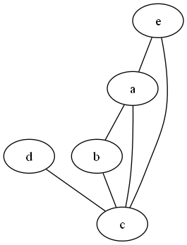 | 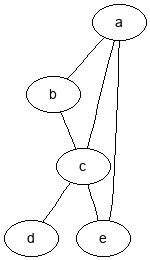 |

---

## neato — spring-model (Kamada-Kawai / stress) layout

| Reference C `dot.exe` | GraphvizPy `gvcli.py` |
|---|---|
| `dot -Kneato test_data/neato_demo.gv -Tpng -o c_neato.png` | `python gvcli.py -Kneato test_data/neato_demo.gv -Tpng -o py_neato.png` |
| 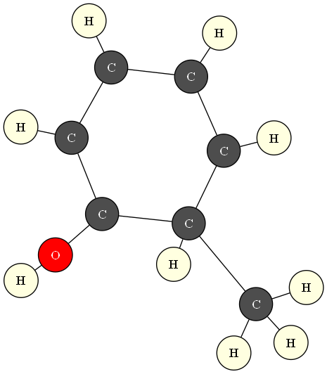 | 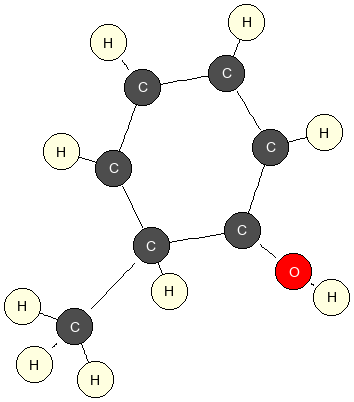 |

---

## twopi — radial layout

| Reference C `dot.exe` | GraphvizPy `gvcli.py` |
|---|---|
| `dot -Ktwopi test_data/twopi_demo.gv -Tpng -o c_twopi.png` | `python gvcli.py -Ktwopi test_data/twopi_demo.gv -Tpng -o py_twopi.png` |
| 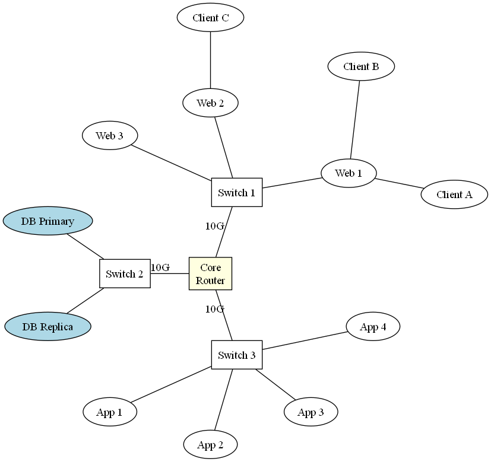 | 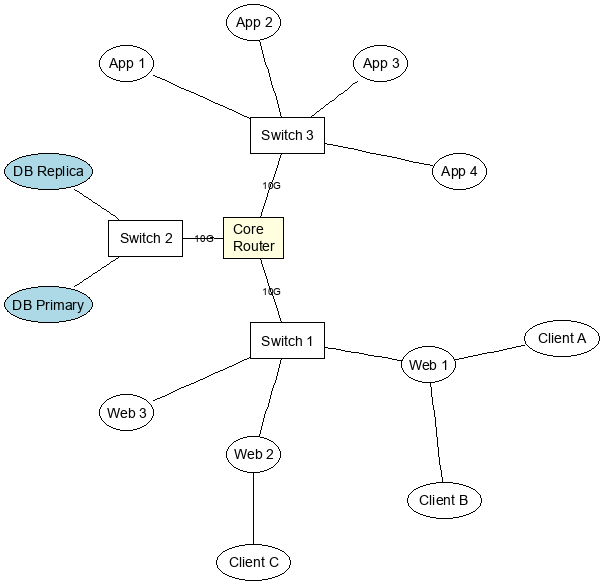 |

---

## fdp — force-directed placement

| Reference C `dot.exe` | GraphvizPy `gvcli.py` |
|---|---|
| `dot -Kfdp test_data/fdp_demo.gv -Tpng -o c_fdp.png` | `python gvcli.py -Kfdp test_data/fdp_demo.gv -Tpng -o py_fdp.png` |
| 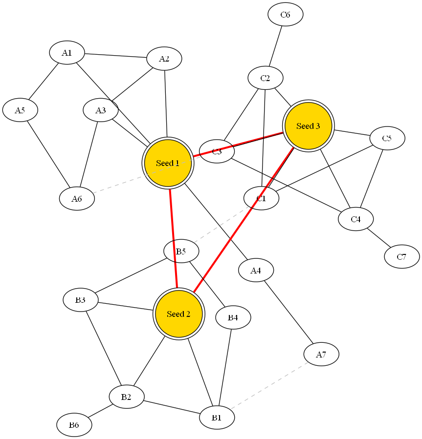 | 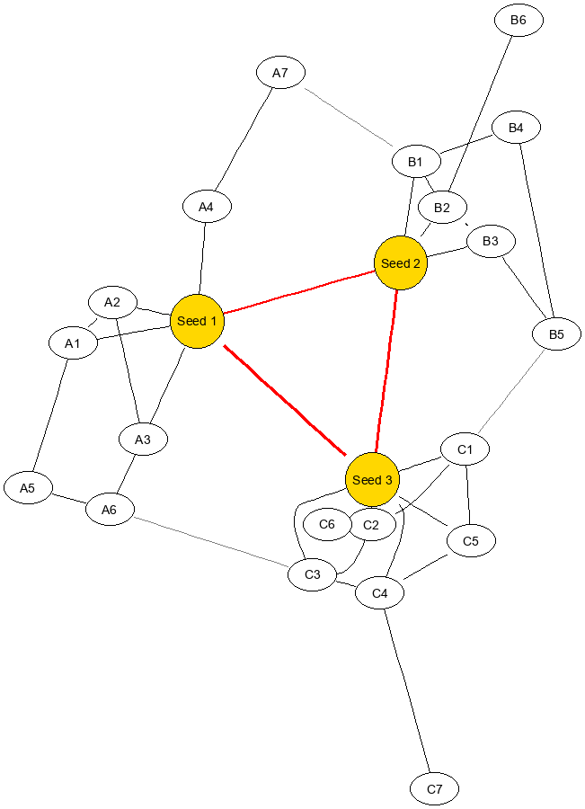 |

---

## sfdp — scalable force-directed (multilevel + Barnes-Hut)

| Reference C `dot.exe` | GraphvizPy `gvcli.py` |
|---|---|
| `dot -Ksfdp test_data/sfdp_demo.gv -Tpng -o c_sfdp.png` | `python gvcli.py -Ksfdp test_data/sfdp_demo.gv -Tpng -o py_sfdp.png` |
| 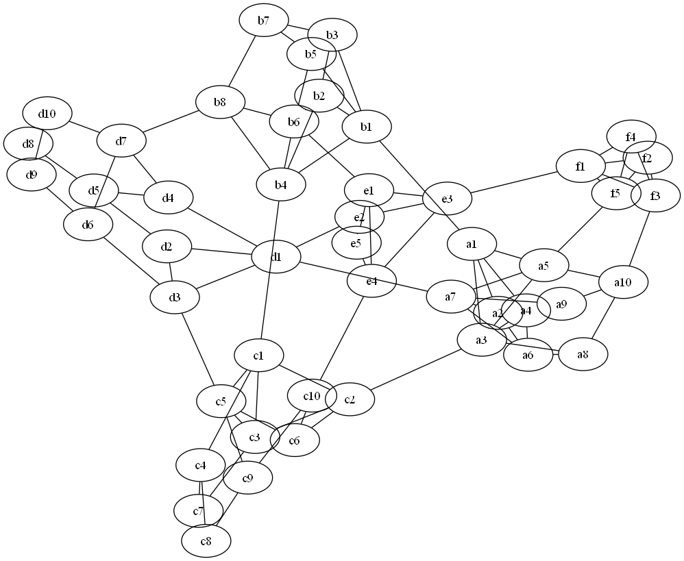 | 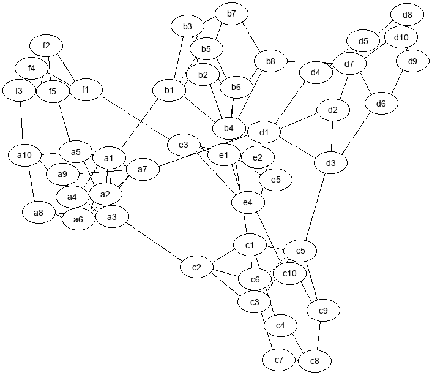 |

---

## osage — clustered array packing

| Reference C `dot.exe` | GraphvizPy `gvcli.py` |
|---|---|
| `dot -Kosage test_data/osage_demo.gv -Tpng -o c_osage.png` | `python gvcli.py -Kosage test_data/osage_demo.gv -Tpng -o py_osage.png` |
| 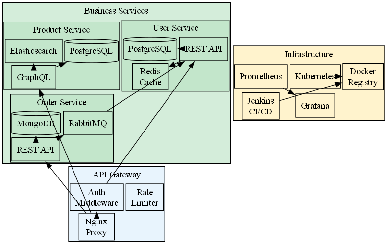 | 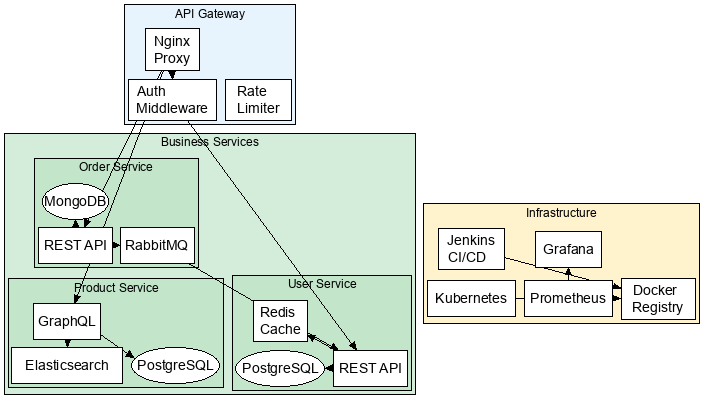 |

---

## patchwork — squarified treemap

| Reference C `dot.exe` | GraphvizPy `gvcli.py` |
|---|---|
| `dot -Kpatchwork test_data/patchwork_demo.gv -Tpng -o c_patchwork.png` | `python gvcli.py -Kpatchwork test_data/patchwork_demo.gv -Tpng -o py_patchwork.png` |
| 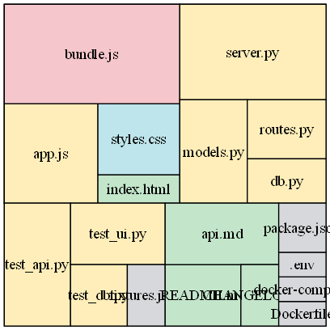 | 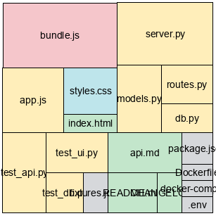 |

---

## circo — circular (block-cut tree) layout

| Reference C `dot.exe` | GraphvizPy `gvcli.py` |
|---|---|
| `dot -Kcirco test_data/circo_demo.gv -Tpng -o c_circo.png` | `python gvcli.py -Kcirco test_data/circo_demo.gv -Tpng -o py_circo.png` |
| 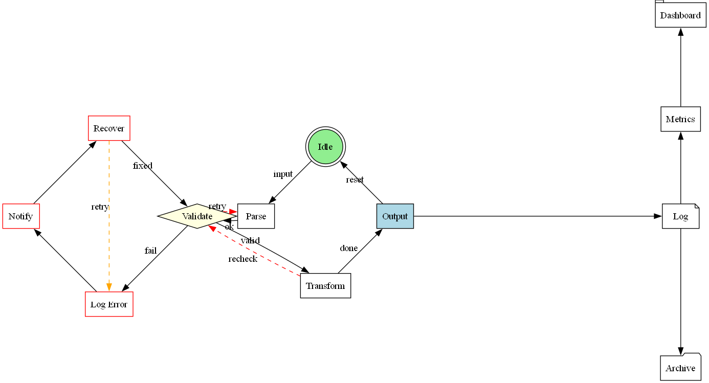 | 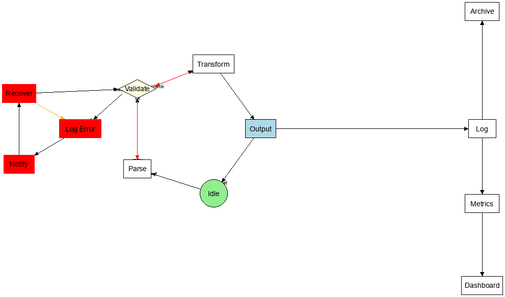 |

---

## Reproducing this report

The two binaries used:

| Path | Binary |
|---|---|
| Reference C | `C:\tools\graphviz\bin\dot.exe` (system Graphviz install) |
| GraphvizPy  | `.venv\Scripts\python.exe gvcli.py` (this repo) |

To regenerate every PNG in this report:

```powershell
# C reference renders
$dot = "C:\tools\graphviz\bin\dot.exe"
foreach ($e in @("dot","neato","twopi","fdp","sfdp","osage","patchwork","circo")) {
    $demo = if ($e -eq "dot") { "example1.gv" } else { "${e}_demo.gv" }
    & $dot -K$e test_data\$demo -Tpng -o Docs\c_$e.png
}

# Python ports
$py = ".venv\Scripts\python.exe"
foreach ($e in @("dot","neato","twopi","fdp","sfdp","osage","patchwork","circo")) {
    $demo = if ($e -eq "dot") { "example1.gv" } else { "${e}_demo.gv" }
    & $py gvcli.py -K$e test_data\$demo -Tpng -o Docs\py_$e.png
}
```
